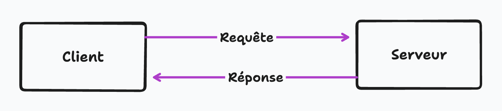
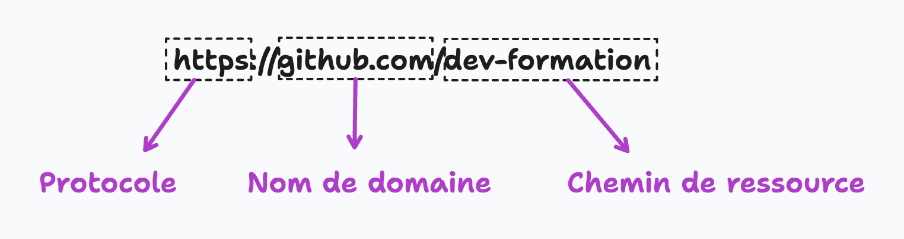
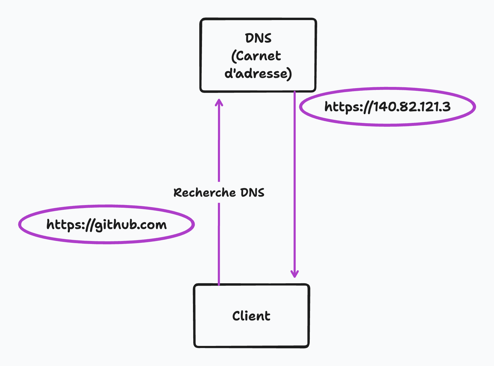
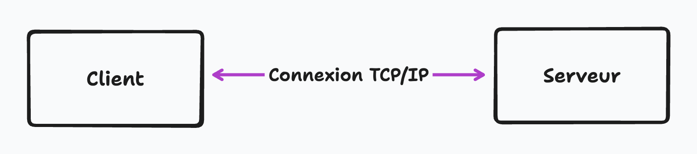
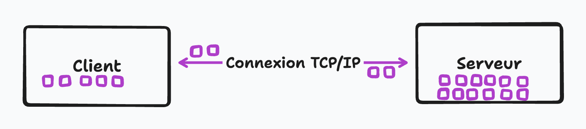
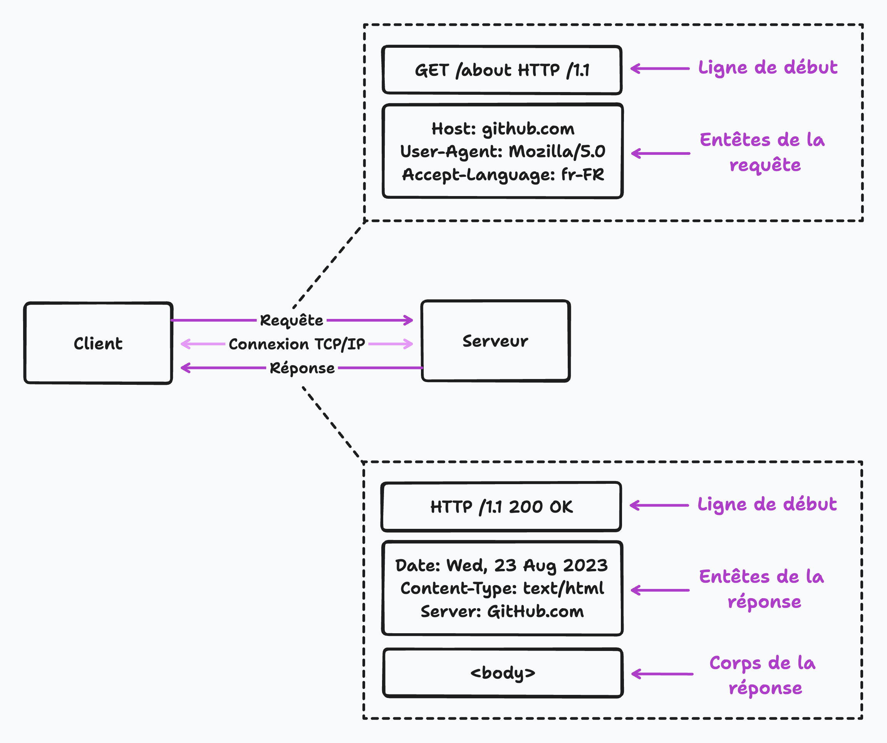
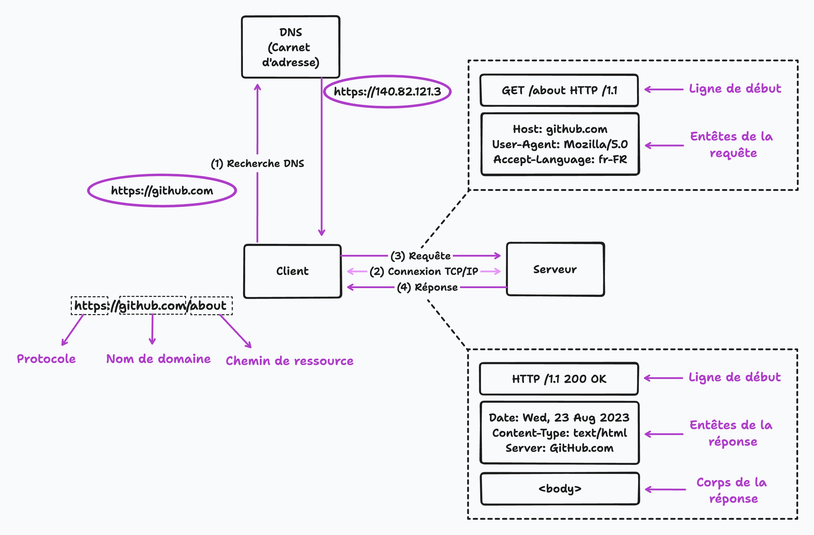
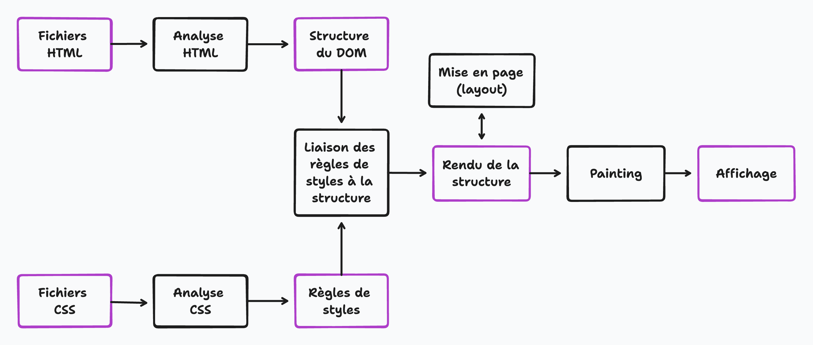

# Comprendre l'architecture du Web: un guide sur le fonctionnement d'Internet

Il est facile de tenir les subtilités du Web pour acquises alors que nous parcourons quotidiennement divers sites Web. Nous entrons une URL dans notre navigateur, et en quelques secondes, tout un site Web apparaît. Mais avez-vous déjà cessé de vous interroger sur la technologie et les processus qui rendent cela possible? Cet article explore les divers composants et technologies qui font de l'expérience apparemment sans effort d'accès au Web une réalité.

De plus, vous n'avez pas besoin de savoir comment le Web fonctionne pour écrire du code. Mais cela vous aidera à comprendre l'ensemble du système.

## Que se passe-t-il lorsque nous essayons d'accéder à un site Web

Nous savons que le code de notre site Web n'est pas stocké sur notre ordinateur. Nous devons introduire le code dans notre ordinateur ou navigateur où il est conservé pour visiter le site Web. Comment cela se produit-il?

Le processus est assez simple. Lorsque nous entrons une URL dans notre navigateur, le navigateur envoie une demande de données nécessaires au serveur. Le serveur répond ensuite en renvoyant le code et les données du site. Le navigateur interprète les codes et affiche le site Web à consulter. Ce processus est connu sous le nom de demande-réponse architecture de modèle ou de serveur client.

## Que sont les clients et les serveurs?

Les clients sont ces appareils connectés à Internet, comme nos téléphones ou ordinateurs connectés au réseau mobile ou au wi-fi. Le client est l'endroit où se déroule toute l'interaction utilisateur. Dans le contexte du Web, un client est généralement un logiciel d'accès au Web comme un navigateur, tel que Chrome, Firefox ou Safari, qui demande des pages Web et d'autres ressources à partir d'un serveur. Le navigateur Web ( client ) reçoit le code du site Web, puis le rend à l'utilisateur pour le visualiser. Bien que nous accédions au site Web à partir du navigateur, nous pouvons traiter l'ensemble de l'appareil comme un client de l'architecture client-serveur.

À l'autre extrémité du spectre se trouvent des serveurs, des ordinateurs spécialisés conçus pour stocker et gérer des données, des sites Web et des applications Web. Ces serveurs sont appelés tels car ils servent du code ou des données en réponse aux demandes des clients. Un serveur attend que les demandes arrivent des clients, traite la demande, puis renvoie les informations demandées. Il existe différents types de serveurs, tels que les serveurs Web, les serveurs de fichiers et les serveurs de base de données, chacun avec sa fonction spécifique. Dans cet article, nous nous concentrerons principalement sur les serveurs Web.

## Qu'est-ce qu'une URL et comment est-elle résolue?

Une URL ( Uniform Resource Locator ) est une chaîne de caractères qui spécifie l'emplacement d'une ressource sur Internet. Les URL sont utilisées pour identifier et localiser des pages Web, des images, des vidéos et d'autres ressources sur le World Wide Web. Les URL contiennent généralement plusieurs parties, y compris un protocole, un nom de domaine et un chemin.

parties d'URL

Le protocole est la méthode utilisée pour transférer des données sur Internet. Le protocole le plus utilisé pour le Web est HTTP ( Hypertext Transfer Protocol ) ou HTTPS ( HTTP Secure ), une version plus sécurisée de HTTP qui crypte les données pour plus de sécurité.
Le nom de domaine est le nom unique qui identifie un site Web ou un serveur Web sur Internet. Pour accéder à un site Web, le nom est saisi dans la barre d'adresse du navigateur. Par exemple, “ github.com ” est le nom de domaine du site Web de Github.
Le chemin indique l'emplacement de la ressource au sein du serveur. Cette partie URL comprend généralement le nom de fichier ou le dossier contenant la ressource, tel que “ à propos de ” ou “ contact. ” Par exemple, “ github.com/about ” est le chemin d'accès à la page du site Web “ github.com. ”
Facultativement, l'URL peut également inclure une chaîne de requête, un ensemble de caractères ajoutés à la fin de l'URL qui contient des informations ou des paramètres supplémentaires pour la ressource.

Il est intéressant de noter que le nom de domaine que nous entrons dans le navigateur n'est pas l'adresse physique réelle du site Web. Chaque site Web et appareil connecté à Internet a une adresse IP unique, une étiquette numérique souvent difficile à retenir. Pour le rendre plus facile à retenir, nous utilisons des noms de domaine. Lorsqu'une URL est entrée, le navigateur envoie d'abord une demande au serveur DNS ( Domain Name System ), qui correspond au nom de domaine à l'adresse IP correspondante du site Web. C'est ce qu'on appelle DNS Lookup. Ce processus est facilité par votre fournisseur de services Internet et renvoie l'adresse IP, y compris le numéro de port du serveur accessible.

## Établissement de protocoles

Lorsque nous entrons une adresse Web et obtenons l'adresse IP réelle du site Web dans le navigateur, une connexion connue sous le nom de socket TCP / IP est établie entre le navigateur et le serveur. Cette connexion reste active pendant le transfert de fichiers du serveur vers le client.

TCP ( Transmission Control Protocol ) et IP ( Internet Protocol ) sont deux des principaux protocoles qui composent la suite du protocole Internet ( IP ). Ensemble, ils jettent les bases de la communication sur Internet.

TCP ( Transmission Control Protocol ) est l'un des principaux protocoles de la suite de protocoles Internet ( TCP / IP ), qui est utilisé pour établir et maintenir des connexions entre les appareils sur un réseau. La fonction principale de TCP est d'assurer la livraison fiable des données entre les appareils.

TCP décompose les données en petits morceaux appelés paquets avant leur envoi sur le réseau. Chaque paquet est étiqueté avec un en-tête TCP, qui comprend les numéros de port source et de destination, et un en-tête IP qui se compose des adresses IP source et de destination, pour l'identifier. Chaque paquet contient également un numéro de séquence qui permet au dispositif récepteur de remonter les paquets dans le bon ordre. Si un paquet est perdu ou corrompu pendant la transmission, TCP retransmettra automatiquement le paquet pour s'assurer que tous les paquets sont reçus correctement.

Ce protocole fournit également un contrôle des flux et un contrôle de la congestion. Le contrôle des flux garantit que l'expéditeur ne submerge pas le récepteur en envoyant trop de données à la fois, et le contrôle de la congestion garantit que le réseau ne devient pas trop chargé par trop de trafic.

Il s'agit d'un protocole orienté connexion qui établit une connexion virtuelle entre l'expéditeur et le récepteur avant d'échanger des données. Une fois la connexion établie, les deux parties peuvent échanger des données de manière fiable et ordonnée.

TCP est largement utilisé dans de nombreuses applications, notamment la navigation sur le Web, le courrier électronique, le transfert de fichiers et les jeux en ligne. Il s'agit d'un protocole fiable et efficace qui garantit que les données sont fournies correctement et dans le bon ordre, ce qui en fait une partie essentielle de l'infrastructure Internet.

De l'autre côté, IP adresse et achemine les paquets entre les appareils d'un réseau. Il attribue une adresse IP unique à chaque appareil connecté à Internet. Lorsque les données sont envoyées d'un appareil à un autre, le protocole IP détermine l'adresse de destination et le meilleur itinéraire pour les données à prendre. Son travail consiste à envoyer et à acheminer tous les paquets via Internet.

TCP et IP travaillent ensemble pour fournir une communication fiable et efficace sur Internet. IP adresse et achemine les paquets de données, tandis que TCP garantit que les données sont fournies correctement et dans le bon ordre. Il s'agit de protocoles de communication ou du système de contrôle des fondamentaux d'Internet qui définit et définit les règles de déplacement des données sur le Web. Le protocole de communication fixe les règles de communication de deux ou plusieurs parties en leur sein.

Une fois la connexion établie, le processus de communication commence par une requête HTTP envoyée depuis le navigateur. HTTP, ou Hypertext Transfer Protocol (protocole de transfert hypertexte), est le protocole standard de transmission de données sur Internet et est l'épine dorsale du World Wide Web. Il permet au navigateur d'envoyer des demandes à un serveur Web et de recevoir la réponse du serveur.

HTTP est basé sur un modèle de réponse à une demande dont nous avons discuté précédemment, dans lequel un client ( tel qu'un navigateur Web ) envoie une demande à un serveur, et le serveur envoie une réponse.

Les requêtes HTTP comporte différentes parties, qui incluent la ligne de départ ( Méthode HTTP + cible de demande + Version HTTP ), en-tête de requête HTTP et corps de demande.

Les méthodes HTTP les plus courantes sont GET, qui demande une ressource au serveur, et POST, qui envoie des données au serveur à traiter. Il existe également des méthodes PUT et Patch qui sont utilisées pour modifier les données.

HTTP se trouve au-dessus de la pile de protocoles TCP / IP. Il est généralement utilisé avec les protocoles SSL / TLS ( Secure Sockets Layer / Transport Layer Security ) pour fournir une communication sécurisée et cryptée sur Internet.

Lorsque le serveur reçoit la demande, il la traite et renvoie une réponse HTTP. La réponse HTTP est composée de plusieurs parties:

La ligne de démarrage comprend la version HTTP, le code d'état et le message. La version HTTP indique la version du protocole HTTP utilisée. Le code d'état est un code numérique à trois chiffres qui indique le résultat de la demande. Le message d'état est une brève description textuelle du code d'état.

L'en-tête de réponse HTTP contient des informations supplémentaires sur la réponse, telles que le type de contenu dans le corps de réponse, la date et l'heure d'envoi de la réponse et le nom du serveur.

Le corps de réponse contient les données réelles ou le fichier HTML qui ont été demandés.

Le développeur principal est responsable de la spécification des données incluses dans l'en-tête de réponse. Ces données peuvent inclure des éléments tels que le type de contenu, la date et l'heure et le nom du serveur. Dans le corps de réponse, nous obtenons les données ou le fichier HTML demandés dans la demande d'origine. Si le serveur ne peut pas localiser la page demandée, il enverra un message d'erreur HTTP 404 indiquant que la page n'a pas pu être trouvée.

## Que se passe-t-il ensuite après que notre navigateur a reçu la réponse?

Lorsqu'un navigateur Web reçoit un document HTML ( Hypertext Markup Language ) d'un serveur Web, il analyse le document pour le convertir en une représentation visuelle qui peut être affichée à l'utilisateur. Le processus d'analyse d'un document HTML comprend les étapes suivantes:

Le navigateur commence par lire le code HTML de haut en bas, ligne par ligne.

En lisant le code, le navigateur recherche des balises, qui sont utilisées pour définir la structure et la mise en page du document. Par exemple, la balise < html > indique le début d'un document HTML, et les balises < head > et < body > indiquent le début des sections tête et corps du document, respectivement. Le navigateur comprend comment interpréter le code par un algorithme d'analyse HTML.

Lorsque le navigateur rencontre des balises, il crée des éléments correspondants dans le modèle d'objet de document ( DOM ), une représentation arborescente du document HTML. Le navigateur l'utilise pour comprendre comment la page doit être rendue et affichée. Chaque élément du DOM correspond à une seule balise dans le code HTML, et nous pouvons manipuler ces éléments en scriptant un langage comme JavaScript.

Le navigateur analyse le document pour des actifs supplémentaires afin de rendre la page correctement. Ces actifs peuvent inclure des fichiers CSS, des fichiers JavaScript, des images et d'autres fichiers multimédias. Lorsque le navigateur rencontre une référence à un actif dans le document HTML, il envoie une demande supplémentaire au serveur pour récupérer cet actif. Le navigateur répétera ce processus pour chaque actif qu'il rencontre. Par exemple, si le document HTML est lié.

Pour un fichier CSS, le navigateur demandera au serveur de récupérer ce fichier. Le fichier CSS sera ensuite analysé et utilisé pour appliquer les styles visuels aux éléments définis dans le HTML. De même, s'il y a des images sur la page, le navigateur enverra une demande au serveur pour chaque image et les rendra sur la page. Il est important de noter que le navigateur ne téléchargera et n'analysera que les actifs nécessaires pour la fenêtre actuelle ou la partie visible de la page Web. C'est ce qu'on appelle le chargement paresseux. Lorsque l'utilisateur fait défiler la page, le navigateur téléchargera et analysera les actifs supplémentaires au besoin. Ce téléchargement et cette analyse d'actifs supplémentaires peuvent avoir un impact sur les performances de la page Web, car cela peut prendre du temps pour récupérer et traiter ces fichiers. Par conséquent,les développeurs doivent optimiser le chargement de ces actifs pour garantir que la page se charge rapidement et efficacement.

Il est important de comprendre que HTML ne fournit pas d'informations sur la façon dont un site Web doit apparaître visuellement. Il définit uniquement la structure et indique au navigateur les différentes parties du contenu, comme les en-têtes, les images et les paragraphes.

CSS ( Feuilles de style en cascade ) fournit des informations de style visuel et de présentation pour une page Web. CSS permet aux développeurs de spécifier la police, la couleur, la taille et la position des éléments sur une page Web, ainsi que d'autres propriétés visuelles. CSS peut être lié à un document HTML et sera utilisé pour appliquer les styles aux éléments définis dans le HTML.

Le navigateur utilise également JavaScript pour ajouter des fonctionnalités dynamiques aux pages Web, comme la validation de formulaire et les éléments interactifs.

Une fois le processus d'analyse terminé, le navigateur rend la représentation visuelle du document HTML, avec laquelle l'utilisateur peut interagir et afficher dans la fenêtre du navigateur.

Le processus d'analyse est complexe, mais il est effectué rapidement et efficacement par des navigateurs Web modernes, permettant aux utilisateurs d'interagir de manière transparente avec les pages Web. Après tout analyser, la connexion est fermée.

C'est tout pour l'instant! Cependant, de nombreux autres processus et technologies complexes font fonctionner Internet. Cet article devrait vous donner un aperçu des parties essentielles du Web, mais gardez à l'esprit qu'il y a beaucoup plus à apprendre et à explorer dans le domaine du Web.

Bonne apprentissage!

[Article original en anglais](https://hackernoon.com/understanding-the-architecture-of-the-web-a-guide-to-how-the-internet-works)
Ecris par Faisal@thefaisal.
