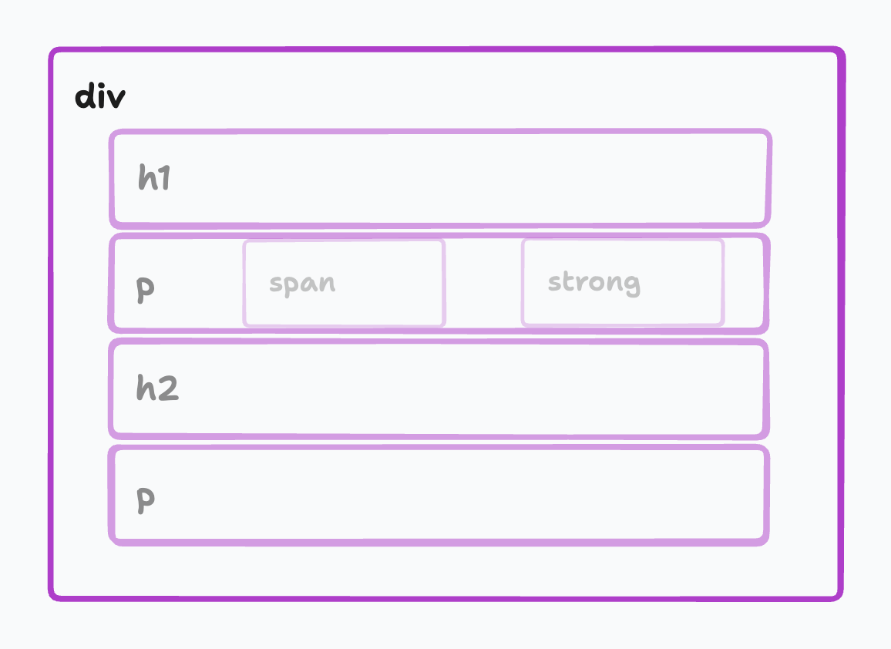
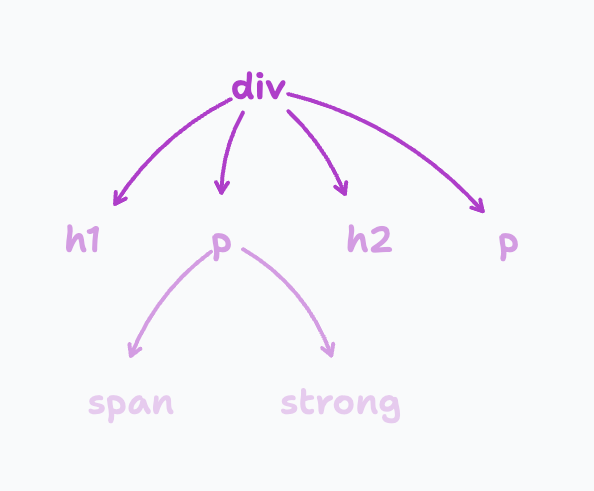

# Introduction CSS

## Ajouter du style à nos pages

### Comment ?

Possible d’ajouter directement dans une balise à l’aide de l’attribut style **MAIS** manque de maintenabilité

```html
<span style="color:red;">Mon texte rouge</span>
```

Dans la balise `<head>`

```html
<head>
  <!-- ... -->
  <style type="text/css">
    span {
      color: red;
    }
  </style>
  <!-- ... -->
  <head></head>
</head>
```

---

## Bonnes pratiques

Liaison directement dans le document html dans le `<head>`

```html
<link rel="stylesheet" type="text/css" href="style.css" />
<!-- Ou -->
<link rel="stylesheet" href="style.css" />
```

---

## Les bases de la syntaxe

### En bref

- Sélecteur : cible l'élément sur lequel on applique les propriété (balise, class,
  id)
- Propriété : définie l’effet que l’on veut utiliser (couleur, taille, position, etc), elle sont à l'intérieur d'**accolades**
- Valeur de la propriété (red, 5px, #fff, etc)
- Les commentaires sont aussi possibles

```css
sélecteur {
  propriété: valeur;
  propriété: valeur;
  /* Commentaire */
}
/* Commentaire */
```

→ Le tout constitue une **déclaration CSS**

---

## Type de sélecteur, hiérarchie, parent/enfant

### Type de sélecteur

On peut sélectionner n’importe quel élément HTML pour lui appliquer un style

Ici tous les textes contenus dans des balises `<span>` seront de couleur rose

```css
span {
  color: pink;
}
```

Il faut bien garder en tête que l'ordre de déclaration de tes éléments à une importance : si deux sélecteurs portent sur le même élément la dernière déclaration sera la seule effective

Souviens toi qu'il est possible de mettre la même classe sur plusieurs éléments html. Grâce à cela tu peux donc appliquer le même style à plusieurs éléments.

```css
h1 {
  color: pink;
}
h1 {
  color: blue;
}
```

⚠️ En css pour désigner une classe il faut que tu précèdes son nom d'un point.

```html
<div class="ma-classe">
  ce texte sera de couleur rose
  <div>
    <p class="ma-classe">et ce texte aussi</p>
  </div>
</div>
```

```css
.ma-classe {
  color: pink;
}
```

L'inverse est aussi possible : plusieurs classes css peuvent être appliquées sur un même élément html

```html
<div class="classe-bleu taille-txt">
  ce texte sera de couleur bleu et de taille 10px
  <div>
    <p class="classe-bleu">ce texte sera juste en bleu</p>
  </div>
</div>
```

```css
.classe-bleu {
  color: blue;
}
.taille-txt {
  font-size: 10px;
}
```

Pour sélectionner avec précision un élément possédant une classe on colle le nom de la balise avec le nom de la classe

```html
<div class="classe-bleu">
  ce texte sera de couleur bleu
  <div>
    <p class="classe-bleu">Mais pas ce texte</p>
  </div>
</div>
```

```css
div.classe-bleu {
  color: blue;
}
```

→ Test juste ici : [https://codepen.io/Jeremy_Bojko/pen/abGvqaq](https://codepen.io/Jeremy_Bojko/pen/abGvqaq)

Parlons maintenant des identifiants. En fait il n'y a pas grand chose à dire : même rôle que les classes mais il doit être unique dans la page

⚠️ En css pour désigner un identifiant il faut que tu précèdes son nom d'un dièse

```html
<div id="mon-id">ce texte sera de couleur rose</div>
```

```css
#mon-id {
  color: pink;
}
```

Pour les plus fous les mélanges sont possible !

```html
<div id="mon-id" class="ma-classe">
  ce texte sera de couleur rose
  <div class="ma-classe">mais pas celui la</div>
</div>
```

```css
div#mon-id.ma-classe {
  color: pink;
}
```

### Pseudo classes

Une pseudo classe permet d'ajouter à un sélecteur un état spécifique dans lequel il doit être pour être ciblé et que le style s'applique à lui.

```html
<div class="ma-classe">ce texte sera de couleur rose au survol</div>
```

```css
.ma-classe:hover {
  color: pink;
}
```

⚠️ En css pour désigner une pseudo classe il faut que tu précèdes son nom de 2 points (`:`)

👉 Liste de toute les pseudo classes disponible : [Mozilla Docs](https://developer.mozilla.org/fr/docs/Web/CSS/Pseudo-classes)

🕹️ Pour expérimenter c'est ici : [Lien vers Codepen](https://codepen.io/Jeremy_Bojko/pen/KKNVoWN)

### Hiérarchie et généalogie

Voici un extrait de code et sa représentation schématique se faire cette représentation peut aider lorsque tu voudras agir avec précision sur certains éléments html à travers ton css

```html
<div>
  <h1>J'aime la papaye</h1>
  <p>
    Pourquoi j'aime ce <span>fruit</span>? Pour sa <strong>texture</strong>!
  </p>

  <h2>Les fraisiers</h2>
  <p>Tout mes apprenants me font des fraisiers, et vous ?</p>
</div>
```





Par exemple pour un sélecteur de descendance tu aurais ce code. Ici on agit sur tout les `<span>` enfants de `<p>` (dans l'exemple il n'y en a qu'un seul)

```css
p span {
  color: pink;
}
```

⚠️ Note bien l'**espace** entre le `p` et le `span`

Par exemple pour une sélecteur de groupe tu aurais ce code. Ici on agit sur tout les `<h1>` et tout les`<h2>`

```css
h1,
h2 {
  color: pink;
}
```

Avec ces schéma il est aussi très important de bien comprendre la notion de portée de variable : Le style d'un élément html impact tout ses enfants mais peut être "écrasé" si la même propriété est redéfinis pour ses enfants.

🕹️ Pour expérimenter c'est ici : [Lien vers Codepen](https://codepen.io/Jeremy_Bojko/pen/JjbGoMd)

🕹️ Pour vérifier si tu as bien tout compris c'est ici : [Lien vers CSS Diner](https://flukeout.github.io/)

---

## Couleurs, unités

### Les couleurs en CSS

- Notation Hexadécimal : #ffffff (blanc)
- Notation Hexadécimal courte : #fff (blanc)
- Notation RGB : rgb(255, 255, 255) / rgba(255, 255, 255, 1)
- Notations HSL : hsl(0, 0%, 100%) / hsla(0, 0%, 100%, 1)
- Mots clés : white

👉 [https://htmlcolorcodes.com/fr/](https://htmlcolorcodes.com/fr/)

🕹️ Pour expérimenter c'est ici : [Lien vers Codepen](https://codepen.io/Jeremy_Bojko/pen/KKNVRGG)

→ Rendu final attendu du Codepen


Unités

- Le pixel : 1px (fixe, dépendante de la résolution de périphérique)
- Le cadratin : 1em (relative à la taille de police de l’élément parent)
- Si la police de base est en taille 10px alors 2em = 20px
- Le pourcentage : 10% (relative à la taille de leur parent)

---

## Typographie et polices

```css
body {
  font-family: Arial, Helvetica;
}
```

```css
body {
  font-size: 18px;
}
```

```css
body {
  line-height: 1.5;
}
```

```css
body {
  font-weight: bold;
}
```

```css
body {
  color: #ffffff;
}
```

```css
body {
  font-style: italic;
}
```

```css
p.align-center {
  text-align: center;
}
```

---

## Bordures et background

### Les bordures

Pour appliquer une bordure à un élément on utilise la propriété `border`. Elle a 3 sous propriétés : `width`, `style` et `color`

→ `border` : `width` `style` `color`;

```css
p {
  border: 1px solid #111111;
}
```

On peut décomposer en 4 bordures : border-top, border-left, border-right, border-bottom

```css
p {
  border-top: 1px solid #111111;
}
```

Il existe différents **style de bordures** :

- `none` : pas de bordure
- `dotted` : pointillés
- `dashed` : tirets
- `solid` : un trait simple

```css
p {
  border-top: 1px dashed #111111;
}
```

Pour mettre en place des bordures arrondies on utilise la propriété `border-radius` : valeur

```css
p {
  border-radius: 10px;
}
```

Et tu peux avoir mettre en place des paramètre plus en détail. Tu travailles alors coin par coin l'ordre est important : haut gauche, haut droite, bas droite, bas gauche

```css
p {
  border-radius: 10px 2px 5px 1px;
}
```

---

## Dimensionnement

🕹️ [Lien vers Codepen](https://codepen.io/Jeremy_Bojko/pen/QWGyBQG)

---

## Positionnement

Sous forme d'exercice : [lire cet article](https://www.freecodecamp.org/news/css-positioning-position-absolute-and-relative/)

🕹️ Pour vérifier si tout est compris direction ces exercices : [Lien vers Codepen](https://codepen.io/Jeremy_Bojko/pen/qBqbqKP)

---

## Fiche récap CSS

👉 [https://htmlcheatsheet.com/css](https://htmlcheatsheet.com/css)
