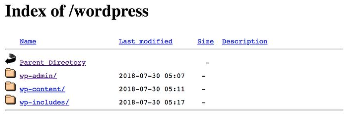

# Introduction HTML

## Les bases d'un site

### Qu'est-ce qu'une page web ?

→ Un fichier texte (par exemple en .html) éditable comportant des éléments avec du sens. On parle de sens sémantique

→ Une page web peut contenir du texte, des liens vers d'autres pages, ou plus largement, des liens vers d'autres types de fichier (images, vidéo, etc)

### Qu'est-ce qu'un site web ?

→ Plusieurs pages web liées formant un ensemble cohérent dans la plupart du temps (on essaye en tout cas !)

→ Le réseau internet permet d'y avoir accès partout dans le monde, pour les sites web publiés et rendu disponible au public. La suite tu la connais, il te suffit d'y accéder via ton navigateur en tapant l'URL de ton site préféré (par exemple : [https://estcequecestbientotleweekend.fr/](https://estcequecestbientotleweekend.fr/)) et bam le site web s'affiche dans ton navigateur !

### Pour aller plus loin ?

→ Tim Berners-Lee ? Qui est ce Monsieur important pour le Web 🙏 ([Wikipedia](https://fr.wikipedia.org/wiki/Tim_Berners-Lee))

→ W3C : World Wide Web Consortium ([Website](https://www.w3.org/))

→ Validateur syntaxique W3C ([Website](http://validator.w3.org/))

---

## Syntaxe HTML : balises, éléments, attributs

### Qu'est-ce qu’une balise ?

- Elles permettent de structurer le contenu de ta page
- Chaque balise possède un rôle précis et a donc un poids sémantique : Dans une page, une balise `h1` comportera une information importante, par exemple un titre, tandis qu'un `p` ne servira qu'à afficher du texte.
- Par convention, toute balise ouverte doit être fermée (même s'il y a quelques exceptions)
- Une balise est composée d'un nom et d'attributs

Un exemple de balise span au sein d'une page HTML

```html
<h1>Hello World !</h1>
```

→ Les spécifications HTML définissent les noms des balises : `<html>`, `<body>`, `<span>`, ``, `<div>`, `<a>`, `<p>`, `<header>`...

Pour avoir la liste exhaustive de tous les éléments, direction la documentation !

👉 [Mozilla Developper Network Docs](https://developer.mozilla.org/fr/docs/Web/HTML/Element)

### Imbrication de balises

Après avoir parlé de la plus petite brique d'un site, qu'est-ce qu'on en fait ? L'idée est dans le titre, il est possible d'imbriquer des balises pour obtenir une organisation hiérarchique :

<iframe height="300" style={{'width': '100%'}} scrolling="no" title="Imbrication balise" src="https://codepen.io/Jeremy_Bojko/embed/eYRdGeg?default-tab=html%2Cresult&editable=true" frameborder="no" loading="lazy" allowtransparency="true" allowfullscreen="true">
  See the Pen <a href="https://codepen.io/Jeremy_Bojko/pen/eYRdGeg">
  Imbrication balise</a> by Jérémy Bojko (<a href="https://codepen.io/Jeremy_Bojko">@Jeremy_Bojko</a>)
  on <a href="https://codepen.io">CodePen</a>.
</iframe>

Attention à imbriquer correctement tes éléments, l'ordre a du sens et le code ci-dessus n'est pas le même que celui-ci dessous :

<iframe height="300" style={{'width': '100%'}} scrolling="no" title="Imbrication HTML 2" src="https://codepen.io/Jeremy_Bojko/embed/mdwrBXv?default-tab=html%2Cresult&editable=true" frameborder="no" loading="lazy" allowtransparency="true" allowfullscreen="true">
  See the Pen <a href="https://codepen.io/Jeremy_Bojko/pen/mdwrBXv">
  Imbrication HTML 2</a> by Jérémy Bojko (<a href="https://codepen.io/Jeremy_Bojko">@Jeremy_Bojko</a>)
  on <a href="https://codepen.io">CodePen</a>.
</iframe>

Même si visuellement on obtient pour l'instant le même résultat, la structure de nos 2 pages sont bien différentes.

🕹️ Pour expérimenter c'est ici :

<iframe height="300" style={{'width': '100%'}} scrolling="no" title="Imbrication balise" src="https://codepen.io/Jeremy_Bojko/embed/zYovqgR?default-tab=html%2Cresult&editable=true" frameborder="no" loading="lazy" allowtransparency="true" allowfullscreen="true">
  See the Pen <a href="https://codepen.io/Jeremy_Bojko/pen/zYovqgR">
  Imbrication balise</a> by Jérémy Bojko (<a href="https://codepen.io/Jeremy_Bojko">@Jeremy_Bojko</a>)
  on <a href="https://codepen.io">CodePen</a>.
</iframe>

### Attributs et valeurs

→ Il est possible d’ajouter des attributs aux balises pour modifier son comportement ou donner plus de précision sur certains paramètres (source d’une image, classe, liens, etc)

→ Plusieurs attributs peuvent être mis sur une balise

```html
<span class="nom-classe"> Hello World ! </span>
```

Ici, on a donc un élément HTML composé :

- d’une balise : `span`
- d’un attribut : `class`
- d’une valeur pour cet attribut : `nom-classe`
- et du contenu de notre élément : `Hello World !`

→ Il est possible de visualiser les différents attributs existants sur la doc :

👉 [Mozilla Docs](https://developer.mozilla.org/fr/docs/Web/HTML/Attributes)

💻 Essayer de rechercher dans la console de votre navigateur

- Sur Firefox : clic droit sur un élément d'une page - inspecter - onglet Inspecteur - clic droit sur un élément - Afficher les propriétés DOM
- Sur Chrome : clic droit sur un élément d'une page) inspecter - onglet Properties

⚠️ Les attributs sont toujours positionnés dans la **balise ouvrante !**

### Quelques exemples

```html

```

Ici les attributs de notre balise `img` sont :

- `src` : servant à définir le fichier image que tu vas afficher sur ta page
- `width` : servant à définir la largeur de ton image
- `height` : servant à définir la hauteur de ton image
- `alt` : servant à afficher un texte alternatif descriptif si l'image n'a pas pu être chargée, les informations de cet attribut servent aussi au malvoyant

```html
<a href="https://monsite.com">Mon lien vers ma ressources</a>
```

Ici l'attribut de notre balise `a` est :

- `href` : servant à définir la ressource vers laquelle l'utilisateur sera redirigé lors du clic sur lien

```html
<span id="mon-id"> Du texte en ligne </span>
```

Ici l'attribut de notre balise `span` est :

- `id` : servant à définir un identifiant pour notre balise

⚠️ Cet identifiant est **unique →** 2 balises ne doivent pas avoir le même `id`

```html
<p class="ma-class">Mon petit paragraphe</p>
```

Ici l'attribut de notre balise `p` est :

- `class` : servant à définir une classe pour notre balise

⚠️ Cette classe peut apparaitre sur plusieurs balises et une balise peut avoir plusieurs classes

---

## Autopsie d'une page HTML valide

- DOCTYPE obligatoire (valider la page, version HTML, sinon peut faire bugger le navigateur)
- `<html>` la base de toute page : contient en général l'entête `<head>` et le corps `<body>`
- Attribut `lang` : indexation, synthèse vocale, vérification orthographique
- `<head>` entête du document contient : les méta-informations liens feuille css/js
- `UTF-8` définit l’encodage de caractère de la page (directement sous `<head>`)
- `<title>` contient le titre affiché dans l’onglet du navigateur (important pour le référencement)
- `<body>` contenu de votre page

```html
<!DOCTYPE html>
<html lang="fr">
  <head>
    <meta charset="UTF-8" />
    <title>Document</title>
  </head>
  <body></body>
</html>
```

### Balises méta

Les balises méta servent à donner des paramètres (un comportement ou des informations non visibles par l'utilisateur) à votre page, plusieurs fonctions sont possibles :

→ Redirection automatique

```html
<meta http-equiv="refresh" content="5;url=https://example.com" />
```

→ Spécificité mobile (indispensable pour ne pas avoir de surprise avec le responsive)

```html
<meta name="viewport" content="width=device-width, initial-scale=1" />
```

→ Information de la page

```html
<meta name="application-name" content="OpenStreetMap" />
```

→ Référencement

```html
<meta name="description" content="sert au référencement" />
```

💻 Essayer de rechercher dans la console de votre navigateur

- La balise meta contenant la description du site [marmiton](https://www.marmiton.org/)

### Commentaires

Pour pouvoir insérer des commentaires dans sa page HTML vous pouvez utiliser cette notation :

```html
<!DOCTYPE html>
<html lang="fr">
  <head>
    <meta charset="UTF-8" />
    <title>Document</title>
  </head>
  <body>
    <!-- commentaire-->
  </body>
</html>
```

Ce commentaire n'apparaitra donc pas dans votre page, mais il sera visible par vos visiteurs s'ils vont fouiller dans la console du navigateur !

---

## Structurer son contenu et lui donner du sens

### Balise div

- Permet de former des blocs dans votre page
- C’est un conteneur qui peut inclure d’autres balises
- Aucune valeur sémantique (pas de “sens” à proprement parlé)
- Peut être utilisé pour regrouper des blocs et leur donner le même style css

### Balise section

- Comme une div, mais avec du sens, vos sections symbolisent les différentes parties de votre page

### Balise paragraphe

- Élément de type bloc, sera suivi d’un retour à la ligne

⚠️ Attention : il ne faut pas imbriquer les éléments de type `<p>`

```html
<p> Du texte
    <p>
         Encore du texte
    </p>
</p>
```

```html
<p>Du texte</p>
<p>Encore du texte</p>
```

### Balise titre

→ Vous pouvez utiliser les balises de `<h1>` à `<h6>`

- Au delà passage à la ligne
- Hiérarchisation visuelle automatique

```html
<h1>Titre niveau 1</h1>
<h2>Titre niveau 1</h2>
<h3>Titre niveau 1</h3>
<h4>Titre niveau 1</h4>
<h5>Titre niveau 1</h5>
<h6>Titre niveau 1</h6>
```

- Pas de `<hx>` dans un `<p>` et inversement

### Balise blockquote

- Permet de faire mettre en place des citations
- Retour à la ligne ensuite

```html
<blockquote>Tout seul on va plus vite, ensemble, on va plus loin</blockquote>
```

> Tout seul on va plus vite, ensemble, on va plus loin

🕹️ Pour expérimenter c'est ici : [Lien vers exercice CodePen](https://codepen.io/Jeremy_Bojko/pen/GRNpqYq)

---

## Élément de mise en forme

- Ces élément sont inline
- Il se placent autour du contenu/texte
- Pas de retour à la ligne
- Ajout du sens à certaines partie

### Exemple

- `<strong>` : élément sémantique, le texte sera mis en gras (fortement mis en
  valeur)
- `<em>` : élément sémantique, le texte sera mis en italique (mis en évidence)
- `<span>` : permet de d’appliquer un style sur une portion de texte
- `<sup>` : affiche un exposant
- `<sub>` : affiche un indice
- `<small>` : petit caractère comme les copyright

🕹️ Pour expérimenter c'est ici : [Lien vers exercice CodePen](https://codepen.io/Jeremy_Bojko/pen/rNWOLzK)

---

## Lien hypertext ?

### Utilité

- Élément cliquable, permet de renvoyer l’utilisateur sur une nouvelle page ou
  permet un téléchargement
- Mise en avant à l’aide d’un style particulier (souligné et bleu)

Renvoie vers :

→ Page externe

→ Page interne

→ Des fichiers

### Comment ? (page externe)

```html
<a href="http://www.google.fr" title="aller sur ggl">Lien vers GGL</a>
```

Dans cet exemple tu as :

- Un lien vers la page google.fr
- Une infobulle au survol de l'élément

🕹️ Pour expérimenter c'est ici : [Lien vers exercice CodePen](https://codepen.io/Jeremy_Bojko/pen/qBqONeB)

### Lien interne et arborescence de ton site

→ L’ensemble des pages d’un site sont enregistrées dans un dossier appelé
racine du site. Par convention le fichier “racine” est appelé index.html

S’il existe il est affiché en priorité sinon tu peux tomber sur cette visualisation :



Voici un exemple d'arborescence "classique" d'un site web :

```html
|Dossier Site (racine) | |-css | |- style.css | |- js | |-index.js | |index.html
```

🕹Télécharger le dossier ci-dessous et compléter les liens entre chaque pages

[Exercice-liens-hypertext.zip](./assets/Exercice-liens-hypertext.zip)

```html
|Dossier Site (racine) |index.html |-pages | |- page1.html | |-sous-pages | |-
page2.html | |- page3.html
```

### Lien interne et chemin relatif

On parle de chemin relatif lorsque l'on veut faire une référence d'un fichier vers un autre. Il faut donc définir le chemin qui relie l'un à l'autre.

- Si 2 fichiers sont dans le même répertoire on appelle le nom du fichier
- Si on veut faire un lien vers un fichier dans un dossier/répertoire, on ajoute
  le nom du répertoire devant le nom de fichier
- Si on se trouve dans un dossier/répertoire on ajoute ../ devant le nom de
  fichier

### D'autres utilisation des balises ancre

```html
<a href="mailto:email@mail.com"></a>
```

```html
<a href="tel:0102030405"></a>
```

## Liste ordonnée / non ordonnées

```html
<ul>
  <li>Élément 1</li>
  <li>Élément 2</li>
</ul>
```

- Élément 1
- Élément 2

```html
<ol>
  <li>Élément 1</li>
  <li>Élément 2</li>
</ol>
```

1. Élément 1
2. Élément 2

Intérêts :

→ Slider d'image type carrousel

→ Liste de choix ou options à sélectionner

→ Onglet sur un site web

🕹️ Pour expérimenter c'est ici : [Lien vers exercice CodePen](https://codepen.io/Jeremy_Bojko/pen/OJbybPa)

## Les images

### Formats

- JPEG (.jpg, .jpeg) : format compressé, réduction du poids de l’image
- GIF (.gif) : 256 couleurs, compression sans perte, couleur de transparence,
  animation, utilisé pour les logos
- PNG (.png) : PNG8 256 couleurs, PNG24 16 millions couleur + transparence,
  utilisé pour les icône, logo, fond transparent
- SVG : icon permettant un redimensionnement sans dégradation

### Recap

Photo → JPEG

Illustration avec peu de couleur → PNG8

Illustration beaucoup de couleur et/ou transparence → PNG16

Image animée → GIF

Icon redimensionnable → SVG

### Insertion d'images

- On utilise la balise auto fermante ``
- Alt affiche une description alternative si l’image ne se charge pas
  - l’attribut est obligatoire mais vide si l’image
    est décorative
  - lu vocalement par les lecteurs d’écran
  - aide les personnes malvoyante

---

## Fiche récap HTML

👉 [https://htmlcheatsheet.com](https://htmlcheatsheet.com/)
