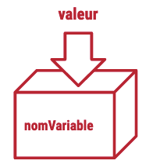
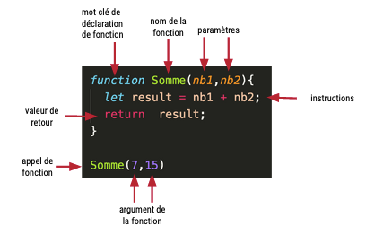

# Introduction JavaScript

## Qu'est ce que le JavaScript ?

Ton voyage au sein de ce nouveau langage commence maintenant. Le JavaScript ou JS, va te permettre d'écrire des scripts permettant entre autre de rendre tes pages web dynamiques. C'est une langage _"léger, interprété, orienté objet"_ ([Mozilla Doc](https://developer.mozilla.org/fr/docs/Web/JavaScript/About_JavaScript)).

### Un peu d'histoire

Le JavaScript a été créé en 1995 par Brendan Eich, un ingénieur de chez Netscape. Il a été créé en 10 jours et à l'origine il s'appelait Mocha, puis LiveScript avant de devenir JavaScript. Il a été créé pour permettre de rendre les pages web dynamiques et interactives. Il a été standardisé en 1997 par l'ECMA (European Computer Manufacturers Association) sous le nom de ECMAScript.

### Où est utilisé le JavaScript ?

Le JavaScript est utilisé dans de nombreux domaines, mais il est surtout connu pour être utilisé dans les pages web. Il est utilisé pour rendre les pages web dynamiques et interactives. Il est également utilisé pour créer des applications web, des applications mobiles, des jeux vidéos, des logiciels, des serveurs, des robots, des objets connectés, etc.

### Qu'est ce qu'un script ?

Un script est un ensemble d'instructions que tu vas donner à ton ordinateur pour qu'il puisse réaliser une tâche. Par exemple, si tu veux que ton ordinateur te dise bonjour, tu vas devoir lui donner une instruction pour qu'il puisse le faire. Tu vas devoir lui dire de t'afficher le message "Bonjour" à l'écran.

## Comment fonctionne le JavaScript ?

Le JavaScript est un langage de programmation qui va te permettre d'écrire des scripts. Ces scripts vont être interprétés par ton navigateur web. C'est à dire que ton navigateur va lire ton script et va l'exécuter. Il va lire ton script ligne par ligne et va exécuter les instructions que tu lui as donné.

### Comment exécuter du JavaScript ?

Pour exécuter du JavaScript, tu vas devoir utiliser un navigateur web. Tu peux utiliser n'importe quel navigateur web, mais il est préférable d'utiliser un navigateur web spécialisé pour le développement web.

### Comment lier un fichier JavaScript à une page web ?

Pour lier un fichier JavaScript à une page web, tu vas devoir utiliser la balise `<script></script>`. Tu vas devoir placer cette balise dans la balise `<head></head>` de ta page web. Tu vas devoir utiliser l'attribut `src` pour indiquer le chemin vers ton fichier JavaScript.

```html
<!DOCTYPE html>
<html lang="fr">
  <head>
    <meta charset="UTF-8" />
    <title>Mon site web</title>
    <script src="script.js"></script>
  </head>
  <body>
    <h1>Mon site web</h1>
  </body>
</html>
```

### Comment executer du JavaScript en dehors du navigateur ?

Il est aussi possible d'executer du JavaScript en dehors d'un navigateur web. Pour cela, tu vas devoir utiliser Node.js. Node.js est un environnement d'exécution JavaScript open source, multiplateforme. Il est basé sur le moteur JavaScript V8 de Chrome.

:::info
Installation de Node.js : [https://nodejs.org/fr/download/](https://nodejs.org/fr/download/)

**Prendre la version LTS (Long Term Support) adaptée au système d'exploitation du PC.**
:::

### Comment écrire un commentaire en JavaScript ?

Pour écrire un commentaire en JavaScript, tu vas devoir utiliser `//` pour écrire un commentaire sur une seule ligne. Tu vas devoir utiliser `/* */` pour écrire un commentaire sur plusieurs lignes.

```js
// Ceci est un commentaire sur une seule ligne

/*
Ceci est un commentaire
sur plusieurs lignes
*/
```

### Comment afficher un message à l'écran ?

Lorsque tu vas commencer à faire des tests et à développer tes premiers programmes, tu vas avoir besoin de connaitre le contenu de tes variables au cours son exécution. Pour cela tu peux utiliser la méthode `log` disponible sur l'objet `console`. Ce sera ton ami pendant un bon moment au cours de ton apprentissage du JS alors utilise le dès que tu en as besoin.

Pour afficher un message à l'écran, tu vas devoir utiliser la fonction `console.log()`. Tu vas devoir placer ton message entre les parenthèses de la fonction `console.log()`.

```js
console.log("Bonjour");
```

:::tip
Tu peux aussi utiliser la méthode `debugger` qui te permettra de mettre un point d'arrêt ou alors de mettre un point d'arrêt et d'activer le débuggage dans VSCode pour voir l'état de tes variables et d'executer ton programme pas à pas. Très pratique pour comprendre le fonctionnement de ton programme.
:::

### Comment déclarer une variable ?

Pour déclarer une variable, tu vas devoir utiliser le mot clé `let` suivi du nom de ta variable. Tu vas devoir utiliser le signe `=` pour affecter une valeur à ta variable.

```js
let prenom = "John";
```

### Comment modifier la valeur d'une variable ?

Pour modifier la valeur d'une variable, tu vas devoir utiliser le signe `=` suivi de la nouvelle valeur de ta variable.

```js
prenom = "John";
```

## Données et variables

### Types de données

En informatique, les données sont le coeur et le carburant de nos ordinateurs. En JavaScript, on peut distinguer différents types de données que tu vas pouvoir utiliser pour créer tes programmes.

- `undefined` : valeur non définie
- `null` : valeur nulle
- `boolean` : type de donnée pouvant être vrai (`true`) ou fausse (`false`)
- `string` : chaîne/suite de caractères
- `number` : nombre entier (`integer`,`int`) ou nombre décimal (`float`)
- `object` : ensemble de plusieurs variables associées grâce à la notation clé-valeur
- `bigint` : nombre entier supérieur à 2^53 (valeur max qu'un `number` peut stocker)

### Qu'est ce qu'une variable ?

Lorsque tu vas créer un programme, tu vas avoir besoin de stocker des données. Par exemple, si tu veux créer un programme qui te permet de calculer la moyenne de tes notes, tu vas avoir besoin de stocker toutes tes notes.

Pour pouvoir stocker et manipuler toutes ces données tu vas utiliser des **variables.** Tu peux te représenter une variable comme une boite ou un carton dans lequel tu vas ranger une valeur. Et pour mieux t'y retrouver tu vas donner un nom à cette variable. (Tu mets une étiquette sur ton carton pour savoir ce qu'il contient)



Ta variable te permettra d'utiliser directement son nom pour y faire référence et accéder à la valeur qu'elle stock. Tu pourras les utiliser pour procéder à des opérations mathématiques ou autre.

Lorsque tu choisis un nom pour ta variable, il faut que tu essayes au maximum de respecter ces 3 règles :

- Le nom doit être le plus **descriptif** possible
- **Évite les abréviations** difficile à comprendre
- Utilise la convention de nommage **camelCase** (1ère lettre minuscule, pas d'espace, majuscule pour les prochains mot)

:::caution
Le nom de ta variable peut contenir des lettres, des chiffres ou des caractères spéciaux, mais ne **peut pas contenir d'espace** et **ne peut pas commencer par un chiffre**
:::

### Déclaration de variable

Avant de pouvoir utiliser une variable pour y stocker quelque chose, tu dois d'abord faire naitre ta variable : on appelle cela **déclarer une variable.** (et comme une naissance, ça ne peut être fait qu'une fois par variable)

Pour déclarer une variable tu dois utiliser le mot clé `let` ou `var` suivi du nom que tu auras choisi pour ta variable.

```js
let numberOfLearner;
var simplonSchool;
```

:::info
Le mot clé `var` est une ancienne façon de déclarer une variable. Il est toujours utilisé mais il est préférable d'utiliser le mot clé `let` qui est plus récent.

- le mot clé let déclare une variable dont la portée est le bloc
- le mot clé var déclare une variable dont la portée est celle de la fonction englobante

:::

Il est possible de faire plusieurs déclarations en même temps en séparant les noms de variable par une virgule.

```js
let fruitList, ingredientList;
```

:::tip
Pour en savoir plus sur le mot clé `let` : [Mozilla doc](https://developer.mozilla.org/fr/docs/Web/JavaScript/Reference/Statements/let)
:::

### Affectation de valeur

Une fois ta variable créé, tu peux maintenant t'en servir. Pour pouvoir stocker une valeur dans une variable, il faut que tu utilises l'opérateur d'affectation `=`.

Ici la donnée de type `Number` , de valeur `14` a été assignée à la variable `numberOfLearner` déclarée précédemment.

```js
numberOfLearner = 14;
```

Si un calcul est présent à la droite du signe `=` , l'opération est exécuter et le résultat du calcul est alors stocké dans la variable.

```js
numberOfLearner = 13 + 1;
```

Il est aussi possible d'affecter la valeur stockée dans une variable dans une autre variable.

```js
learners = numberOfLearner;
```

Il est possible de déclarer et d'initialiser la valeur d'une variable en une seule étape.

```js
let numberOfLearner = 24;
```

Il est aussi possible de faire plusieurs déclarations et initialisations en même temps.

```js
let numberOfLearner = 24,
  learners = 24;
```

### Constantes

Pour éviter les réaffectation par erreur, tu peux utiliser des constantes.

Elle fonctionnes comme les variables sauf que tu ne peux pas modifier leur valeur après affectation.

```js
const NOMBRE_SECONDES_HEURE = 3600;
const HEURE_PAR_JOUR = 24;
```

:::tip 💻 Exercice
Calculer le nombre de secondes dans une année (utiliser des constantes pour déclarer toutes les valeurs fixes puis faites votre calcul)
:::

### Undefined

Lorsqu'une variable est déclarée mais non initialisée, sa valeur par défaut est `undefined`, si tu effectue une opération mathématique sur une variable `undefined` le résultat sera `NaN`, "Not a Number" a guise d'erreur.

Garde cela bien en tête, cela pourra t'aider à résoudre certains bug lorsqu'ils se présenteront !

## Opérations arithmétiques

### Addition

A l'aide du l'opérateur `+`

```js
let panier = 34.1 + 22.5; // panier vaut 56.6
// autre exemple
let prixArticle1 = 34,
  prixArticle2 = 22,
  nouvelArticle = 9;
let valeurPrixPanier = prixArticle1 + prixArticle2; // valeurPrixPanier vaut 56
valeurPrixPanier = valeurPrixPanier + nouvelArticle; // valeurPrixPanier vaut 65
// est équivalent à ci-dessous en plus concis
valeurPrixPanier += nouvelArticle; // valeurPrixPanier vaut 74
// autre exemple
let nombreArticlePanier = 6;
nombreArticlePanier++; // nombreArticlePanier vaut 7
// ceci equivaut à nombreArticlePanier = nombreArticlePanier + 1;
```

:::tip 💻 Exercice
Exercice d'addition :
Imaginez que vous développiez une calculatrice. Écrivez un programme qui demande à l'utilisateur d'entrer le prix de deux articles dans un panier d'achat en ligne, puis affiche la somme totale à payer.
:::

### Soustraction

A l'aide de l'opérateur `-`

```js
let panier = 34 - 22; // panier vaut 12
// autre exemple
let prixArticle1 = 34,
  prixArticle2 = 22,
  remise = 9;
let valeurPrixPanier = prixArticle1 - remise; // valeurPrixPanier vaut 25
valeurPrixPanier = valeurPrixPanier - remise; // valeurPrixPanier vaut 16
//est équivalent à ci-dessous en plus concis
valeurPrixPanier -= remise; // valeurPrixPanier vaut 7
// autre exemple
let nombreArticlePanier = 6;
nombreArticlePanier--; // nombreArticlePanier vaut 5
// ceci equivaut à nombreArticlePanier = nombreArticlePanier - 1;
```

:::tip 💻 Exercice
Exercice de soustraction :
Supposons que vous travaillez sur un projet de gestion de stocks. Écrivez un programme qui demande à l'utilisateur d'entrer la quantité de stock initial d'un produit, puis la quantité vendue. Le programme affiche ensuite la quantité de stock restante.
:::

### Multiplication

A l'aide de l'opérateur `*`

```js
let montantAdditionRepas = nombreApprenant * prixFormuleMidi;
// autre exemple
nombreApprenant *= 2;
// ceci equivaut à nombreApprenant = nombreApprenant * 2;
```

:::tip 💻 Exercice
Exercice de multiplication :
Pensez à un programme de facturation pour un service. Écrivez un programme qui demande à l'utilisateur d'entrer le prix unitaire d'un produit et la quantité achetée, puis affiche le montant total à payer.
:::

### Division

A l'aide de l'opérateur `/`

```js
let prixRepas = montantAdditionRepas / nombreApprenant;
// autre exemple
litreDeCafe /= 2;
// ceci equivaut à litreDeCafe = litreDeCafe / 2;
```

:::tip 💻 Exercice
Exercice de division :
Imaginez que vous développiez un convertisseur de devises. Écrivez un programme qui demande à l'utilisateur d'entrer un montant en euros, puis le taux de change pour une autre devise. Le programme affiche ensuite le montant équivalent dans cette devise.
:::

### Opérateur de reste

A l'aide de l'opérateur `%`

```js
let rest = 11 % 2; // reste vaut 1
```

:::tip 💻 Exercice
Exercice de modulo :
Écrivez un programme qui demande à l'utilisateur d'entrer un nombre entier, puis affiche si ce nombre est pair ou impair.
:::

## Chaines de caractères

### Utilisation

Le type `string` fait référence à une chaines de caractères. Une chaine de caractère est une série de 0 caractères ou plus écris entre des simples ou des doubles guillemets.

<!-- prettier-ignore -->
```js
let juicyFruit = 'Papaye';
// OU
let juicyFruit = "Papaye";
```

### Caractère d’échappement

Si dans une `string` tu as besoin d'utiliser des simples ou doubles guillemets tu peux toujours le spécifier pour que JS ne le considère pas comme la fin de ta `string` à l'aide d'un **backslash** `\` , on l'appelle caractère d'échappement.

<!-- prettier-ignore -->
```js
let sentence = " \"Bonjour\", dit Benji";
```

Il est aussi possible de combiner les deux types de guillemet et ainsi être dispenser de l'utilisation du backslash. Du moment que les guillemets de début et de fin sont cohérents.

```js
let sentence = ' "Bonjour", dit Benji';
// OU
let sentence = " 'Bonjour', dit Benji";
```

Le caractère d'échappement peut avoir d'autres utilités. Il peut t'aider à représenter certains caractère comme une tabulation ou un retour à la ligne.

- `\n` → Retour à la ligne
- `\t` → Tabulation
- `\f` → Saut de page

### Concaténation

Pour construire une nouvelle string à l'aide de deux ou plus, tu peux utiliser l'opérateur `+` , cette opération est appelé la concaténation.

```js
let newString = "Hello " + "coco";
// "Hello coco"
newString += " !";
// "Hello coco !"
let myName = "Jérémy";
newString += " C'est " + myName;
// "Hello coco ! C'est Jérémy"
```

:::tip
Avec la nouvelle syntaxe ES6, il est possible d'utiliser les backticks `` ` `` pour déclarer une string et d'utiliser les `${}` pour insérer une variable dans une string.

```js
let myName = "Jérémy";
let newString = `Hello coco ! C'est ${myName}`;
// "Hello coco ! C'est Jérémy"
```

Pratique et plus lisible !
:::

:::tip 💻 Exercice
Exercice de concaténation :
Écrivez un programme qui demande à l'utilisateur d'entrer son prénom et son nom, puis affiche un message disant : "Bonjour, prénom nom !".
(en replaçant prénom et nom par les valeurs saisies par l'utilisateur 😉)
:::

### Propriété string

Il existe plusieurs propriétés pour les strings :

- `myName.length` : permet de récupérer le nombre de charactères dans une string

- `myName[0]`: accès aux éléments d'une string grâce à leur position dans la string. Attention, la première position est 0 et non 1.

- `myName[myName.length - 1]` : dernier lettre d'une string :

:::tip 💻 Exercice
Exercice de propriété string :
Écrivez un programme qui demande à l'utilisateur d'entrer son prénom puis affiche la première lettre de son prénom, la dernière lettre de son prénom, ainsi que le nombre de lettre de son prénom.
:::

## Les tableaux

### A quoi ça sert ?

Tu vas rapidement te rendre compte que tu vas avoir besoin de stocker beaucoup de valeurs pour pouvoir exécuter tes programmes. Et tu vas aussi avoir besoin de regrouper tes valeur de manières cohérente : c'est là qu'interviennent les `array`.

### Déclaration

Pour pouvoir déclarer un tableau tu vas utiliser des crochets `[ ]` ou alors le constructeur d’objet `new Array()`

```js
let fruits = [];
//ou
let fruits = new Array();
```

### Déclaration et initialisation

Pour pouvoir déclarer et initialiser certaines valeurs d’un tableau tu vas utiliser des crochets `[ ]` entre lesquels tu vas noter tes valeurs à stocker.

```js
let fruits = ["papaye", "cerise"];
```

### Accès aux valeurs

Pour accéder à une valeur d'un tableau il te suffit de renseigner son `index`.

:::warning
En JS les index commence à 0, le premier élément d'un tableau ou la première lettre d'une string est donc placé à l'index 0.
:::

```js
let fruits = ["papaye", "cerise", "noix de coco"];
console.log(fruits[0]); // "papaye"
console.log(fruits[1]); // "cerise"
```

### Écriture des valeurs

```js
let fruits = ["papaye", "cerise", "noix de coco"];
fruits[1] = "framboise"; // ["papaye", "framboise", "noix de coco"];
```

### Tableau à n dimension

Parfois tu auras besoin de stocker des valeur dans un tableau, représentant des données en plusieurs dimension (des pions sur un échiquier par exemple). Il est possible de stocker un tableau dans un autre tableau.

<!-- prettier-ignore -->
```js
let snakeBoard = [
	["🔴", "🟩", "🟩", "🟩"],
	[  "",   "",   "", "🟩"],
	[  "",   "",   "", "🟩"],
	[  "",   "",   "", "🟩"]
]
```

Pour pouvoir accéder aux données de ce tableau il te suffit de renseigner l'index de la première dimension ainsi que l'index de la seconde dimension comme ceci :

```js
snakeBoard[0][0]; // "🔴"
snakeBoard[0][3]; // "🟩"
```

:::tip 💻 Exercice
Exercice de tableau :
Essaye de placer un pion rouge sur une case vide de l'exemple ci-dessus.
Par exemple dans la case de la 2e colonne et 3e ligne. Pour obtenir ceci :

<!-- prettier-ignore -->
```js
let snakeBoard = [
  ["🔴", "🟩", "🟩", "🟩"],
  [ "",   "",   "", "🟩"],
  [ "",  "🔴",  "", "🟩"],
  [ "",    "",  "", "🟩"],
];
```

:::

### Manipulation de données

Tu as plusieurs méthodes disponible te permettant de manipuler les données d'un tableau.

`push()` → ajouter une valeur à la fin de ton tableau

```js
fruits.push("mangue"); // ["papaye", "framboise", "noix de coco", "mangue"];
```

`unshift()` → ajoute une valeur en début de tableau

```js
let firstElement = fruits.unshift("raisin"); // ["raisin", "papaye", "framboise", "noix de coco", "mangue"];
```

`pop()` → retire la dernière valeur d'un tableau et la renvoie

```js
let lastElement = fruits.pop(); // ["raisin", "papaye", "framboise", "noix de coco"];
console.log(lastElement); // "mangue"
```

`shift()` → retire la première valeur d'un tableau et la renvoie

```js
let firstElement = fruits.shift(); // ["papaye", "framboise", "noix de coco"];
console.log(firstElement); // "raisin"
```

`indexOf()` → renvoie l'index de la première occurence d'une valeur dans un tableau

```js
let index = fruits.indexOf("framboise"); // ["papaye", "framboise", "noix de coco"];
console.log(index); // 1
```

`splice()` → permet de retirer ou d'ajouter des éléments à un tableau

```js
let removedElements = fruits.splice(1, 2); // ["papaye", "framboise", "noix de coco"];
console.log(removedElements); // ["framboise", "noix de coco"]
console.log(fruits); // ["papaye"]
```

`slice()` → permet de copier une partie d'un tableau

```js
let copy = fruits.slice(1, 2); // ["papaye", "framboise", "noix de coco"];
console.log(copy); // ["framboise"]
console.log(fruits); // ["papaye", "framboise", "noix de coco"]
```

:::tip 💻 Exercice
Exercice de manipulation de tableau :
Essaye de chercher dans ce tableau de fruits l'emplacement d'une banane et retire la du tableau. Affiche le nouveau tableau dans la console.

```js
let fruits = [
  "papaye",
  "framboise",
  "noix de coco",
  "banane",
  "raisin",
  "mangue",
  "cerise",
  "pomme",
];
```

:::

## La magie des fonctions

### A quoi ça sert ?

Lorsque tes programmes deviennent complexes et pour rester organiser dans ton code, il va falloir que tu le scindes en petites parties. Tu vas vite te rendre compte qu'une suite d'instructions va te servir à plusieurs endroits dans ton code. Pas besoin de copier-coller, pour cela car il y a **les fonctions** !

Elles te permettent d’exécuter à plusieurs endroit un même morceau de code, une même suite d'instructions.

### Comment ça marche ?



### Portée de ta variable

La portée désigne la visibilité ou l'accès ou l'utilisabilité d'une variable. Si une variable est déclarée à l'extérieur d'une fonction, on dit qu'elle a une portée globale.

```js
let favFruit = "banana";

function eatFruit() {
  let favFruit = "cherry";
  console.log(favFruit);
  // "cherry"
}

console.log(favFruit); // "banana"
```

```js
let favFruit = "banana";

function eatFruit() {
  console.log(favFruit);
  // "banana"
}

console.log(favFruit); // "banana"
```

## Prendre des décisions

### Fonctionnement

Dans ton code tu vas mettre en place des morceaux de code qui devront s'exécuter sous certaines condition. Pour cela il faut utiliser le mot clé `if`.

```js
if (maCondition) {
  console.log("La condition est true");
}
```

Tu peux aussi mettre en place un second morceau de code qui sera exécuté si la première condition n'est pas satisfaite.

```js
if (maCondition) {
  console.log("La condition est true");
} else {
  console.log("La condition est false");
}
```

Tu peux aussi mettre en place une autre condition.

```js
if (maCondition) {
  console.log("La condition est true");
} else if (autreCondition) {
  console.log("Autre condition est true");
}
```

Et les trois en même temps.

```js
if (maCondition) {
  console.log("La condition est true");
} else if (autreCondition) {
  console.log("Autre condition est true");
} else {
  console.log("Aucune n'est true");
}
```

⚠️ Les tests sont exécutés dans l'ordre d'écriture, l'ordre est dont important.

### Opérateurs de comparaison

L'instruction `if` sera exécutée si la condition est `true` , elle sera ignorée si la condition est `false`. Tu peux aussi procéder à des comparaisons grâce à différents opérateurs de comparaisons.

- `==` : égal partiel (valeur)
- `===` : égal total (type et valeur)
- `>` : supérieur
- `>=` : supérieur ou égal
- `<` : inférieur
- `<=` : inférieur ou égal
- `!=` : différent de

```js
if (age >= 18) {
  console.log("Majeur");
} else {
  console.log("Mineur");
}

4 == "4"; // true
4 === "4"; // false
```

:::tip 💻 Exercice
Crée une fonction `isAdult` qui prend en paramètre l'année de naissance d'un utilisateur et qui affiche dans la console si l'utilisateur est adulte ou non.
:::

### Opérateurs logiques

Tu peux combiner plusieurs tests à l'aide de ces opérateurs:

- `&&` : ET
- `||` : OU
- `!` : NON

```js
let nombreCafeAvale = 16,
  codeBug = false;

if (nombreCafeAvale > 1) {
  if (!codeBug) {
    console.log("Super journée");
  }
} else {
  console.log("Dure journée");
}
// Se transforme en
if (nombreCafeAvale > 1 && !codeBug) {
  console.log("Super journée");
} else {
  console.log("Dure journée");
}
```

:::tip 💻 Exercice de mise en pratique sur les fonctions
[Dépot Github](https://github.com/Jeremy-Bojko/Exercice-Fonctions)
:::

---

## Exercices

### String

:::tip 💻 Exercice

[Encodeur décodeur](https://github.com/dev-formation/encodeur-decodeur)

[Validation d'heure](https://github.com/dev-formation/validate-hour)
:::

### Tableau + Conditions

:::tip 💻 Exercice

[Fruit tracker](https://github.com/dev-formation/fruits-tracker)
:::

---

### Switch case

Si j’ai plus de 4 `if ... else` à la suite, mieux vaut passer sur un `switch...case` (si tes tests sont compatibles car tu ne peux tester que l’égalité des valeurs). Il est important de remarquer que les valeurs sont testées avec `===`!

```js
switch (nombreCafeAvale) {
  case 1:
    console.log("Tu n'as bu qu'un café...");
    break;
  case 2:
    console.log("Tu as bu 2 cafés.");
    break;
  case 3:
    console.log("Tu as bu assez de café !");
    break;
  case 4:
    console.log("Stop maintenant !");
    break;
  default:
    console.log("Fin de transmission");
    break;
}
```

Il est possible de combiner plusieurs tests comme ceci. Tant qu'un break n'est pas rencontrés, le code du `switch` continue d'être exécuté. ci dessous, le 3, 4 et 5 produiront le même résultat.

```js
switch (nombreCafeAvale) {
  case 1:
  case 2:
    console.log("Tu as 1 ou 2 cafés.");
    break;
  case 3:
  case 4:
  case 5:
    console.log("Tu as bu entre 3 et 5 cafés, stop !");
    break;
  default:
    console.log("Fin de transmission");
    break;
}
```

## Tu radotes ! (Les boucles)

### Boucles `for`

Si l’on connaît le nombre d’itération et/ou que l'on veut avoir le contrôle sur le début et la fin de notre boucle.

```js
let apprenants = ["Abdoulaye", "Alicia", "Abdoul-Nasser", "Caroline"];
for (let index = 0; index < apprenants.length; index++) {
  console.log("Bonjour " + apprenants[index]);
}
```

:::tip 💻 Exercice
Exercice de table de multiplication :
Écrivez un programme qui demande à l'utilisateur d'entrer un nombre entier positif, puis utilise une boucle pour afficher la table de multiplication de ce nombre jusqu'à 10.
:::

### Boucle `for...of`

Pour itérer sur tout mon tableau

```js
for (const apprenant of apprenants) {
  console.log("Bonjour " + apprenant);
}
```

:::tip 💻 Exercice
Exercice de calcul de la moyenne :
Demandez à l'utilisateur d'entrer plusieurs nombres, puis utilisez une boucle pour calculer et afficher la moyenne de ces nombres.
:::

### Boucle `for...in`

Pour itérer sur tout mon tableau, plutôt utiliser pour parcourir les différentes propriétés d'un objet.

```js
for (const index in apprenants) {
  console.log("Bonjour " + apprenants[index]);
}
```

### Boucle `while`

Si l'on ne connait pas le nombre d'itération

```js
let nombreApprenant = 0;

while (nombreApprenant < 24) {
  nombreApprenant++;
}
console.log("La promo est complète");
```

:::warning
Attention aux boucles infinies ! lorsque tu utilises des boucles `while` si ta condition de sortie ne passe jamais à `false` ton code s’exécutera indéfiniment
:::

Il existe une variante à cette boucle : la `do` … `while` .

Elle s’exécutera au moins une fois étant donné que la condition est vérifier à la fin du bloc.

```js
let nombreApprenant = 0;

do {
  nombreApprenant++;
} while (nombreApprenant < 24);
console.log("La promo est complète");
```

---

:::tip 💻 Exercice
Exercice Calcul d'intérêts composés :
Vous avez déposé un montant spécifique d'euros dans votre compte bancaire. Chaque année, le solde augmente au même taux de croissance. Découvrez combien de temps il faudra pour que votre solde dépasse un seuil spécifique avec l'hypothèse que vous ne faites aucun dépôt supplémentaire.

Exemple :
Pour dépôt = 100, taux = 20 et seuil = 170, la sortie doit être
DepositProfit(dépôt, taux, seuil) => 3

Explication :
Chaque année, le montant sur votre compte augmente de 20% (Et oui généreux ce banquier !). Cela signifie que tout au long des années, votre solde serait :
année 0 : 100 €
année 1 : 120 €
année 2 : 144 €
année 3 : 172,8 €

```js
function DepositProfit(deposit, rate, threshold) {
  return 0;
}
```

:::

---

## Exercices d'algorithmie

:::tip 💻 Exercice
Ecrire une fonction permettant de trouver le plus grand nombre dans le tableau et de le retourner.

```js
function LargestNumber() {
  let tab = [2, 4, -1, 28, 3, -10, 29, 12, 21 - 3];

  return;
}
```

:::

:::tip 💻 Exercice
Ecrire un fonction qui va iteré de 1 à 100 et :

- Pour toute les multiples de 3 afficher dans la console le mot 'Fizz'
- Pour toute les multiples de 5 afficher dans la console le mot 'Buzz'
- Pour toute les multiples de 3 et 5 afficher dans la console le mot 'FizzBuzz'

```js
function FizzBuzz() {}
```

:::

:::tip 💻 Exercice
Ecrire une fonction qui prendra en paramètre une année et qui retrounera le siècle auquel elle appartient.

Exemple :<br/>
CenturyFromYear(1905) => 20 <br/>
CenturyFromYear(1700) => 17

```js
function CenturyFromYear(year) {
  return;
}
```

:::

:::tip 💻 Exercice
Ecrire une fonction qui prendre en paramètre un mot composé de lettre minuscule et qui lui donnera un score en fonction du nombre de voyelle et de consonne.

- 1 consonne = 2 points
- 1 voyelle = 1 point

  Exemple :<br/>
  wordScore('abcde') = 8

```js
function wordScore(inputString) {
  return 0;
}
```

:::

:::tip 💻 Exercice
Suite de Fibonacci :
La suite de Fibonacci est une suite d'entiers dans laquelle chaque terme est la somme des deux termes qui le précèdent. Elle commence généralement par les termes 0 et 1 (parfois 1 et 1) et ses premiers termes sont : 0, 1, 1, 2, 3, 5, 8, 13, 21, 34, etc.

Écrivez une fonction qui prend un entier n et renvoie le n-ième terme de la suite de Fibonacci.

```js
function fibonacci(n) {
  return 0;
}
```

:::

:::tip 💻 Exercice
La suite de la suite de Fibonacci :
Écrivez une fonction qui prend un entier n en paramètre et renvoie la somme des n premiers termes pairs de la suite de Fibonacci.

```js
function sumFibonacci(n) {
  return 0;
}
```

:::

:::tip 💻 Exercice
En fonction d'un entier positif num, retournez la somme de tous les nombres impairs de Fibonacci qui sont inférieurs ou égaux à num.

Par exemple, SumOddFiboNumber(10) doit retourner 10 car tous les nombres impairs de Fibonacci inférieurs ou égaux à 10 sont 1, 1, 3 et 5.

Exemples :<br/>
SumOddFiboNumber(10) => 10<br/>
SumOddFiboNumber(1000) => 1785<br/>
SumOddFiboNumber(4000000) => 4613732<br/>

```js
function SumOddFiboNumber(numMax) {
  return 0;
}
```

:::

:::tip 💻 Exercice

Ecrire une fonction qui va retourner les 5 premiers [nombres heureux](https://fr.wikipedia.org/wiki/Nombre_heureux)

```js
function HappyNumber() {}
```

:::

## Les objets

Cette structure de données va te permettre de représenter des objets du monde réel. Tout comme un objet du monde réel possède des caractéristique, un objet JS possède des propriétés.

Une propriété est une association clé et valeur.

### Déclaration

```js
let manga = {};
// OU
let manga = new Object();
```

### Initialisation

Pour initialiser les propriétés d'un objet il te suffit d'utiliser un point suivi du nom de la propriété que tu veux créer sur l'objet pour pouvoir lui associé une valeur et ainsi l'initialiser.

```js
manga.title = "L'attaque des titans";
manga.author = "Hajime Isayama";
manga.year = 2009;
manga.inProgress = true;
```

Tu peux aussi accéder aux différentes propriétés d'un objet avec cette notation.

```js
console.log(manga.title); // "L'attaque des titans"
```

### Déclaration et initialisation

Tu peux aussi utiliser la syntaxe littérale ci dessous qui te permet de déclarer et d'initialiser directement les propriétés d'un objet.

```js
let manga = {
  title: "L'attaque des titans",
  author: "Hajime Isayama",
  year: 2009,
  inProgress: true,
};
```

:::tip
Accéder à la valeur d’une propriété d’un objet de manière dynamique :

```js
const user = {
  name: "Coco",
  age: 29,
};

user.name;
//"Coco"
user["name"];
//"Coco"

let nomDeMaProp = "name";

user[nomDeMaProp];
//"Coco"

nomDeMaProp = "age";
//"age"

user[nomDeMaProp];
//29
```

:::

:::tip Exercice
Ecrire une fonction qui va donner la note correspondant à chaque élève au sein du tableau et
< 60 : E
< 70 : D
< 80 : C
< 90 : B
< 100 : A

```js
function NoterLesEleve() {
  let eleves = [
    {
      Prénom: "Luna",
      Point: 73,
      Note: "",
    },
    {
      Prénom: "Joe",
      Point: 80,
      Note: "",
    },
    {
      Prénom: "Thomas",
      Point: 79,
      Note: "",
    },
    {
      Prénom: "Raman",
      Point: 45,
      Note: "",
    },
    {
      Prénom: "Alexandra",
      Point: 92,
      Note: "",
    },
    {
      Prénom: "Jeanne",
      Point: 42,
      Note: "",
    },
  ];

  return eleves;
}
```

:::

##

## Ressources

👉 [Cours Js Data Structure FreeCodeCamp](https://www.freecodecamp.org/learn/javascript-algorithms-and-data-structures/)

👉 [Site référence cours javascript.info](https://fr.javascript.info)

👉 [10 jeux pour apprendre JS](https://dev.to/dailydevtips1/10-games-to-learn-javascript-155j)
